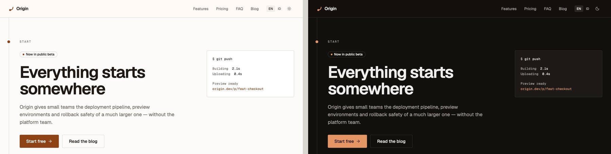

# astro-origin

**Everything starts somewhere.** An Astro starter for a bilingual marketing site and blog — built so that the architecture still holds after you have changed everything else.

[](https://github.com/farulivan/astro-origin/actions/workflows/ci.yml)
[](./LICENSE)
[](https://astro.build)
[](#measured)



```bash
npm create astro@latest -- --template farulivan/astro-origin
```

Then make it yours in one command:

```bash
pnpm install
pnpm setup     # rewrites the name, URL and social links everywhere they appear
pnpm dev
```

**Requirements:** Node 22.12+ and pnpm 11. No environment variables, no database, no backend.

[](https://vercel.com/new/clone?repository-url=https%3A%2F%2Fgithub.com%2Ffarulivan%2Fastro-origin)
[](https://app.netlify.com/start/deploy?repository=https://github.com/farulivan/astro-origin)

## What you get

It is opinionated about one thing — **content is typed, schema-validated data at the bottom of the stack, and components render it rather than author it.** Invalid content fails the build. A missing translation fails typecheck. Everything else follows from that.

- **A landing page and a blog.** Hero, features, pricing, testimonials, FAQ and closing CTA, every word coming from content collections rather than JSX. MDX posts with pagination, tags, reading time, draft filtering and per-locale RSS.
- **Real internationalization.** English and Indonesian, every route written once, a language picker that keeps you on the same page, and a visible notice when an article has not been translated yet. `hreflang` and `x-default` on every page, and a sitemap with locale alternates.
- **Rules that are actually enforced.** Five architectural rules are checked by a script in CI, not written down and forgotten: `.tsx` only inside `islands/`, `getCollection` only in pages and the query layer, Markdown stays on the Sätteri pipeline, the kernels import nothing from Astro, and components translate through `t()`.
- **Accessibility asserted, not claimed.** The Lighthouse budget in CI fails the build below **exactly 1.00** on accessibility, across every page the build produces, in both locales.
- **Astro 7's Sätteri pipeline**, with three working mdast plugins — reading time, git-derived modified time, and external-link marking that announces itself to screen readers in the reader's own language.
- **Zero JavaScript by default.** Blog pages ship none at all. The landing page ships exactly one island, fetched only if you scroll to the pricing table.
- **Light, dark and system themes** with no flash on load, and a warm token palette whose every pair was contrast-checked before a component was built.
- **Tests that run without a browser.** Vitest for the pure logic, Astro's Container API for `.astro` components, Testing Library for the island.

### Measured

Every page the build produces, both locales, asserted on every push:

```
perf 1.00 · accessibility 1.00 · best practices 1.00 · SEO 1.00 · CLS 0.000 · TBT 0ms
```

## Start · Move · Explore

**Start.** `pnpm setup` asks for a name, a URL and a repository, and rewrites them everywhere they appear — `astro.config.ts`, `src/config/site.ts`, `robots.txt`, the web manifest, `package.json` and this README. It refuses to run on a dirty working tree, so `git diff` always shows you exactly what changed.

**Move.** Three files hold almost everything else you would change first:

| Want to change                  | Edit                     |
| ------------------------------- | ------------------------ |
| Brand, URL, nav, posts per page | `src/config/site.ts`     |
| Any user-facing string          | `src/i18n/ui.ts`         |
| Page copy, pricing, posts       | `src/content/`           |
| Colors and typography           | `src/styles/global.css`  |
| What counts as valid content    | `src/content/schemas.ts` |

**Explore.** [docs/ARCHITECTURE.md](./docs/ARCHITECTURE.md) is the full write-up — why Bun was evaluated and rejected, why Astro 7 breaks every remark tutorial you will find, why the pricing toggle is an island and the theme toggle is not, and the real accessibility bugs the Lighthouse budget caught. [docs/ROADMAP.md](./docs/ROADMAP.md) is what is deliberately not here yet.

### Adding a locale

Add it to `LOCALES` in `src/content/schemas.ts`, add a dictionary object in `src/i18n/ui.ts`, add its content. No route, page or component changes — TypeScript will list every string you still owe.

### Adding a page

Create `src/pages/[...lang]/whatever.astro`, copy the `getStaticPaths` block from `index.astro`, and it exists in every locale.

## Scripts

| Command                                    | What it does                                            |
| ------------------------------------------ | ------------------------------------------------------- |
| `pnpm dev`                                 | Dev server                                              |
| `pnpm setup`                               | Rewrite the placeholder identity as your own            |
| `pnpm build` / `pnpm preview`              | Production build, then serve it                         |
| `pnpm test` / `pnpm test:watch`            | Vitest                                                  |
| `pnpm check`                               | `astro check` — types across `.ts`, `.tsx` and `.astro` |
| `pnpm check:arch`                          | The five architectural rules                            |
| `pnpm lint` / `pnpm format` / `pnpm spell` | ESLint / Prettier / cspell                              |
| `pnpm analyze`                             | Build with a bundle treemap at `stats.html`             |
| `pnpm verify`                              | Everything CI runs, in order                            |

## Architecture in one screen

```
Pages       src/pages/[...lang]/**   resolve locale, query content, set SEO
Layouts     src/layouts/**           <html lang> + theme, head, fonts
Sections    src/components/sections/ props in, HTML out — never query
UI          src/components/ui/       primitives
Islands     src/components/islands/  the ONLY .tsx
─────────────────────────────────────────────────────────────
Schemas     src/content/schemas.ts   pure Zod   ← invalid content fails build
i18n        src/i18n/ui.ts           pure TS    ← missing string fails typecheck
Config      src/config/site.ts
Lib         src/lib/
─────────────────── content boundary ────────────────────────
Query       src/content/queries.ts   locale + fallback rules
Content     src/content/**           Markdown / MDX / JSON
Build-time  src/mdast/**             Sätteri enrichment
```

The content boundary is the point: swapping Markdown files for a CMS is a change to the `loader` lines in `src/content.config.ts` and nothing else.

## Three things that will surprise you

1. **Astro 7 does not run remark plugins.** It renders Markdown with Sätteri, a Rust processor with its own AST. Nearly every "add X to your Astro Markdown" article online is a remark plugin and will silently do nothing. The plugins in `src/mdast/` are Sätteri plugins.
2. **A prop named `as` breaks Astro's `Props` binding.** It is a TypeScript keyword, and defining it as a prop stops Astro typing `Astro.props` — which surfaces as confusing implicit-`any` errors in _other_ files. Polymorphic components here use `tag`.
3. **Git-derived "last modified" dates are wrong on Vercel.** Vercel clones at depth 2 and will not let you change it, so `git log` resolves to the wrong commit. Frontmatter `updatedDate` is the source of truth; the git timestamp is a fallback.

There is a fourth, for completeness: writing an angle-bracket tag name inside a `.astro` frontmatter comment can panic the `.astro` to TSX transform with `slice bounds out of range`. The file compiles to nothing and every importer then fails with "is not a module", pointing at the innocent files rather than the comment. Describe elements in prose instead.

## Deployment

Static output, so any host works. `vercel.json` and `netlify.toml` are both included. No SPA rewrite is needed — Astro emits a real file per route, in every locale.

## Contributing

Issues and pull requests are welcome. `pnpm verify` is the gate; see [CONTRIBUTING.md](./CONTRIBUTING.md).

## License

[MIT](./LICENSE).
